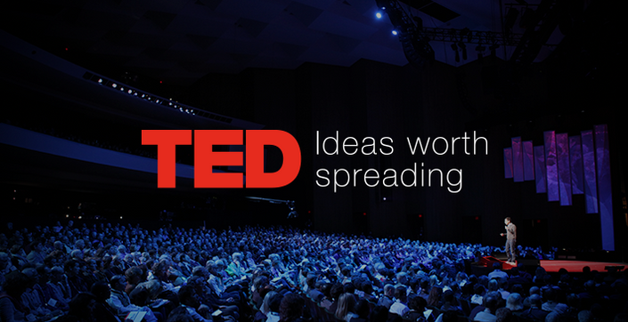

```{r setup, include=FALSE}
knitr::opts_chunk$set(echo = TRUE)
```

## Descripción

El conjunto de datos generado como parte de esta actividad práctica reúne diferentes características de las charlas realizadas en los eventos de TED.

TED es una organización sin fines de lucro dedicada al concepto  "Ideas que vale la pena difundir". 

En una conferencia TED, se les pide a los principales pensadores y hacedores del mundo que den su discurso en 18 minutos o menos. Los oradores de TED han incluido a Roger Ebert, Sheryl Sandberg, Bill Gates, Elizabeth Gilbert, Benoit Mandelbrot, Philippe Starck, Ngozi Okonjo-Iweala, Brian Greene, Isabel Allende y el ex primer ministro británico Gordon Brown. 

En TED.com, las charlas de las conferencias de TED se comparten con el mundo de forma gratuita como videos de TED Talks. A través del Proyecto de traducción abierta, las charlas TED son subtituladas por voluntarios de todo el mundo en más de 90 idiomas. 

Algunas de las variables que se recogen en el conjunto de datos son la fecha, el tema, los ponentes, el número de visitas o o los idiomas disponibles.

## Imagen identificativa



## Contexto

Como se ha comentado, la materia del conjunto de datos se corresponde con las charlas realizadas en las conferencias TED y subidas a la página web de dicha organización.

\newpage
## Contenido

Para cada accidente, el cual se corresponde con un registro en el conjunto de datos, se recogen las siguientes características:

* **posted_date**: Fecha de publicación en el formato dd-mm-aaaa.  
* **update_date**: Fecha de realización del proceso de web scraping.  
* **talk_title**:  Título de la presentación.  
* **talk_description**: Descripción del tema de la presentación.  
* **talk_main_speaker**: Principal ponente de la presentación.  
* **talk_speakers_info**: Nombre y enlace a los perfiles de los ponentes..  
* **talk_link#**: Enlace al vídeo de la presentación.  
* **talk_lang**:  Idioma de la presentación.  
* **available_languages**: Idiomas disponibles en las transcripciones de la presentación.  
* **talk_topics**: Principales temas de la presentación.  
* **talk_duration**: Duración total de la presentación.  
* **talk_trancript**: Transcripción de la presentació.
* **talk_upload_video_date**: Fecha de subida del vídeo de la presentación.  
* **talk_views**: Total de visitas de la ponencia.

## Agradecimientos

Los datos han sido recolectados desde la página principal de [TED](https://www.ted.com/talks). Para ello, se ha hecho uso del lenguaje de programación Python y de técnicas de *Web Scraping* para extraer la información alojada en las páginas HTML.

## Inspiración

El presente conjunto de datos podría utilizarse en ámbitos muy diversos. 

Debido a la popularidad de las charlas educativas, podria utilizares para generar un repositorio de conferencias junto a otros eventos como pueden ser los de [*99U*](https://99u.adobe.com/), [*Creative Mornings*](https://creativemornings.com/) o las [*Google Talk*](https://talksat.withgoogle.com/).

También podria ser interesante expandir dicho proyecto orientandolo a la *mineria de datos*. Realizando un análisis en mayor profundidad extrayendo, por ejemplo, los comentarios y las valoraciones de los usuarios, se podria valorar cuales son los temas de mayor relevancia según franja de edad, género y campo de estudio así como qué tipo de presentación recibe mejor aceptación y en qué momento se genera un ambiente de discordia.

## Licencia

La licencia elegida para la publicación de este conjunto de datos ha sido **CC BY-SA 4.0 License**. Los motivos que han llevado a la elección de esta licencia tienen que ver con la idoneidad de las cláusulas que esta presenta en relación con el trabajo realizado:

* *Reconocimiento* — Se debe reconocer adecuadamente al autor, proporcionado un enlace a la licencia e indicar si se han realizado cambios.

* *CompartirIgual* — Si se realiza cualquier tipo de trabajo sobre este proyecto, es necesarop difundir dichas contribuciones bajo la misma licencia que el original. 


## Código fuente y dataset

Tanto el código fuente escrito para la extracción de datos como el dataset generado pueden ser accedidos a través de [este enlace](https://github.com/Rem-Blanch/Web-scraping-TED).

## Recursos

1. Lawson, R. (2015). Web Scraping with Python. (2nd ed.). : Packt Publishing Ltd.
2. Mitchell, R. (2015). Web Scraping with Python: Collecting Data from the Modern Web. (2nd ed.). : O’Reilly Media, Inc.
3. Tagliaferri, L. (2019). Digital Ocean. Retrieved 07 April, 2020, from https://www.digitalocean.com/community/tutorials/how-to-scrape-web-pages-with-beautiful-soup-and-python-3
4. Richardson, L. (2004). Beautiful Soup documentation. Retrieved 07 April, 2020, from https://www.crummy.com/software/BeautifulSoup/bs4/doc/
5. Miller, W. (2018). William Miller's Projects. Retrieved 12 April, 2020, from https://wamiller0783.github.io/TED-scraping-post.html